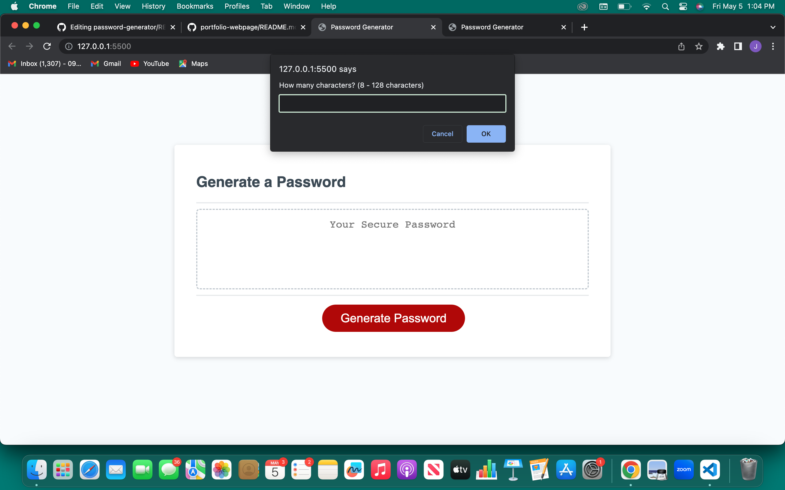

# password-generator
A starter code for a password generator that I edited in order to allow the user to put specifications they want for their password.

## Built With
The web application was built with JavaScript, HTML, and CSS.

## Features
The password generator will generate a random password between 8-128 characters by asking a series of questions.

## Visuals
The application will appear like this when deployed:

  
  ## Deployment
  
  The following link will take your to the deployed site:
  
